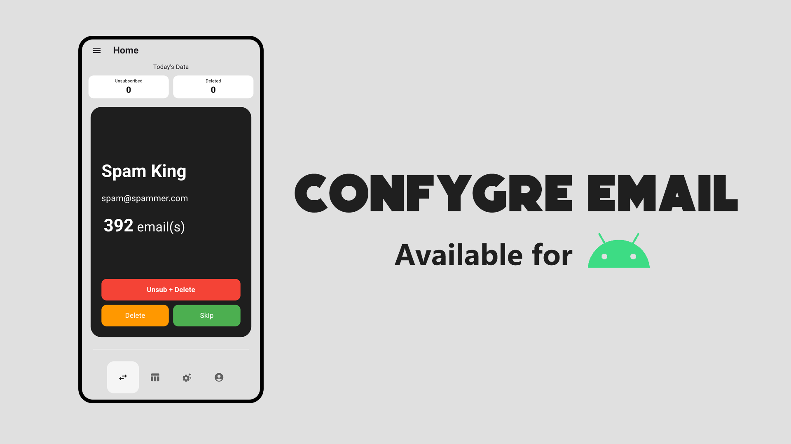

# Confygre Email

Confygre Email is a powerful, open source app designed to simplify your email management. With features like one click unsubscribe, unlimited email deletion, and efficient inbox cleaning, Confygre Email helps you regain control of your inbox effortlessly. Created by a passionate developer, it’s built to offer a seamless, ad free experience with no restrictions. Clean, organize, and declutter your inbox with Confygre Email today!

**Currently in Beta**: I am new to app development. This app may contains some issue.

## Screenshot

## Download Confygre Email App
- You can download the app from the release page 👉[here](#)
- By default, there is alread an API key created using confygre@gmail.com. But it's not verified. It will show you warning message when singin in.
- Please check the project id in the warnign prompt. It must be: ###########
- Your own Gmail Auth API key can be added in the app if you don't want to use default API key.

## Local Development

To build this app, please follow the below steps

- Install and setup [Android Studio](https://developer.android.com/studio)
- Copy and pase this in your cmd or terminal `https://github.com/confygregit/ConfygreEmail.git`
- Open the cloned project in your Android Studio and make a build
- You need to build the app with the key files, this is required for SHA1 key which will be required for oAuth key generation.

## Usage

- SignIn in the app with your Gmail account
- In the home page you will get email accounts from your inbox with the following options,
    - **Unsubscribe**: will uninstall and delete all the emails from the sender.
    - **Delete**: will delete all the emails but won't unsibscribe.
    - **Skip**: will not delete and unsubscribe. Email will added to the whitelist.
- Some emails cannot be unsubscribed, but they can still be deleted.

## Use your own oAuth
Use the below SHA-1 and create an Android firebase project to make your own oAuth key. You can use this oAuth in the app.

PackageName: com.confygre.email
SHA-1: c2:9c:08:fe:d5:25:c2:f2:b5:e4:07:3f:39:87:62:d2:57:17:12:6a

## Have any issues?
Please raise an issue from issue tab: [Issues](https://github.com/confygregit/ConfygreEmail/issues) or send en email to **confygre@gmail.com**

## License
The app is available as open source under the terms of the GPL License.